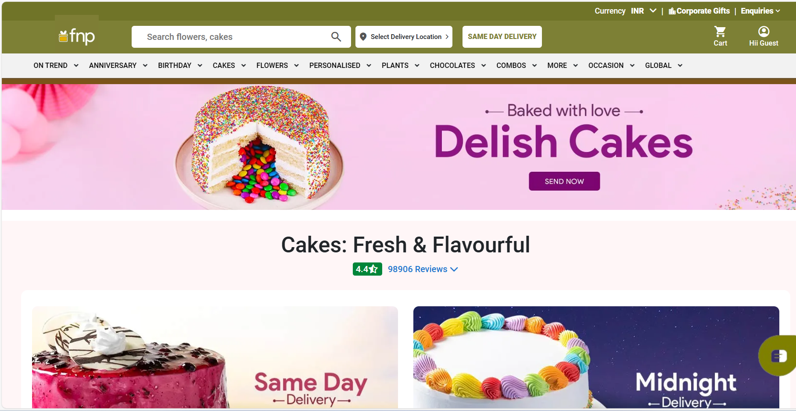
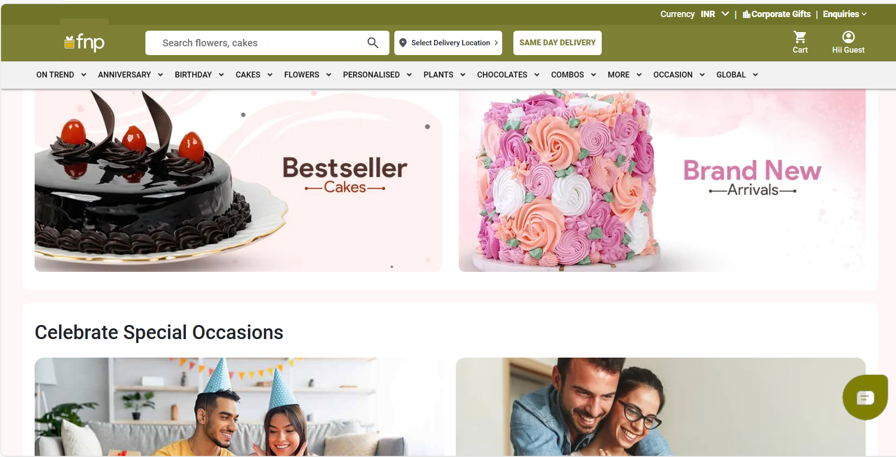
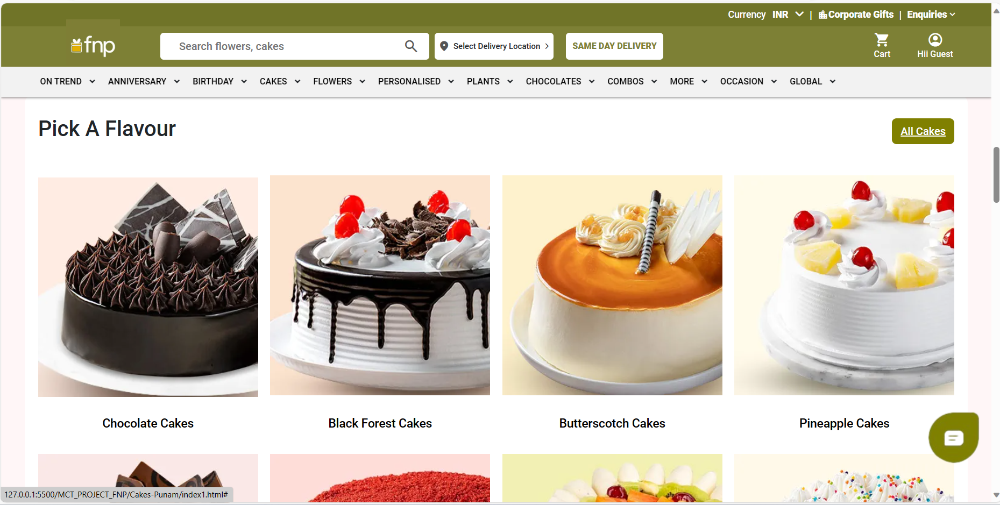
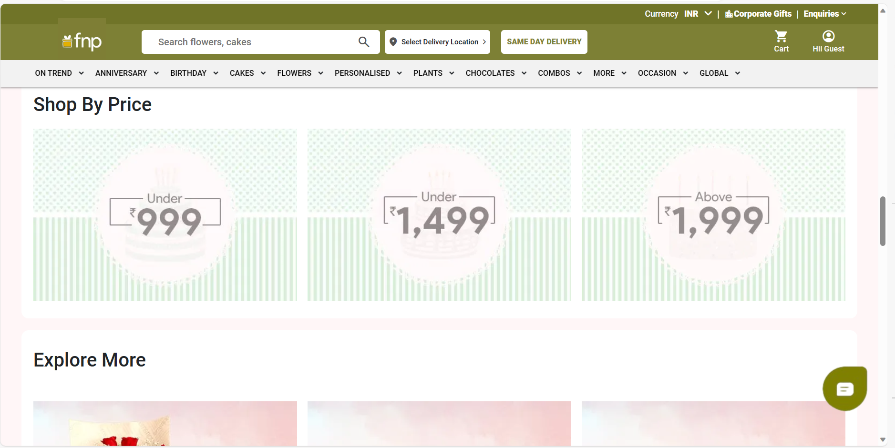
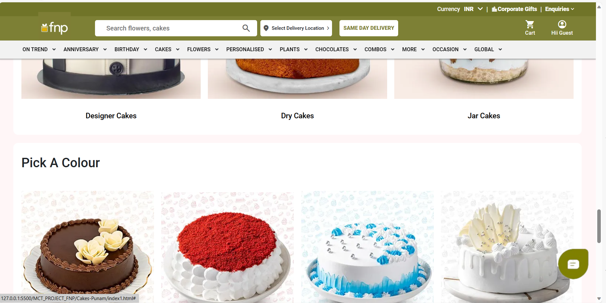
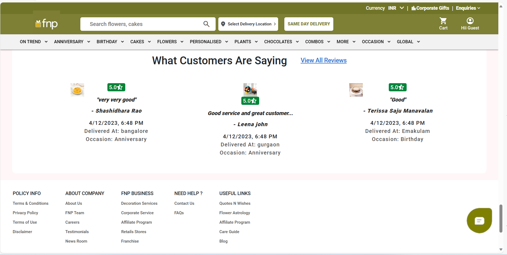
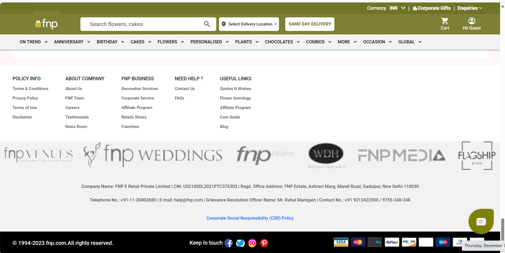

# FNP Project

## Page Overview
The index.html page gives users an immense experience by allowing users to search for various categories and features.

## Technologies Used:
 - HTML: Structuring the project's UI for optimal display.

  - CSS: Styling elements to create a responsive interface.

  
## Semantic Tags:

- main
- header
- footer
- section

## Non-Semantic Tags:

- div
- button
- p
- h2
- br
- img
- select
- option
- script

## Its Features are:
Responsive: All pages are designed to provide a seamless experience across various devices.

Links Pages: Links to all the valuable information about the various sections.

## Technologies Used:

  -  HTML: Structuring the project's UI for optimal display.

  -  CSS: Styling elements to create a responsive interface.

## External Libraries:
Font Awesome for icons

Google Material Icons for additional icons

## Screenshots:

## Learning and Insights:

Responsive Web Design:
Made sure websites work well on all devices.

Browser Tools for Debugging:
Used browser tools to find and fix issues in the code.

Relative Units for Responsive Pages:
Used relative units to ensure pages look good on different screen sizes.

Clean Code with HTML, CSS:
Emphasized writing organized and clear code for interactive and appealing websites.

GitHub Learning:
Learned how to use GitHub for collaboration in projects.

Building Confidence as a Web Developer:
Gained confidence in web development skills.
  
